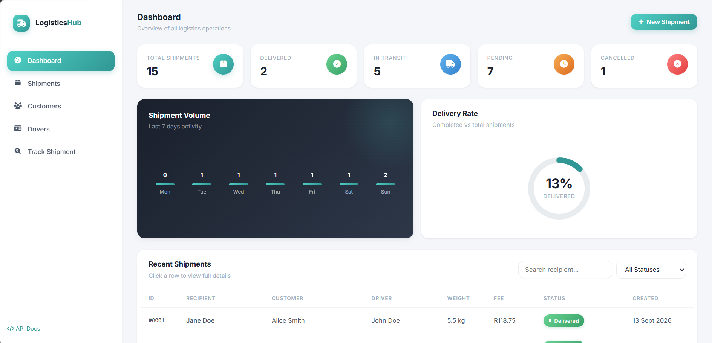
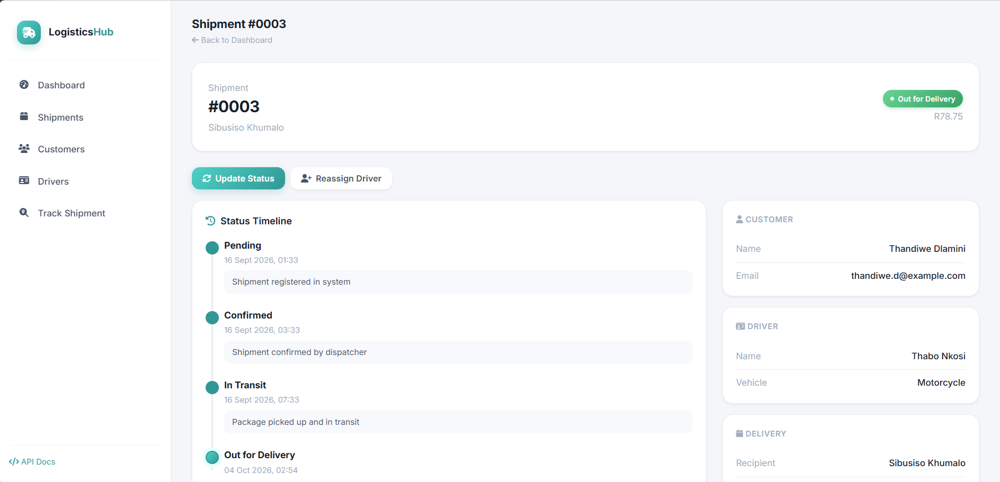
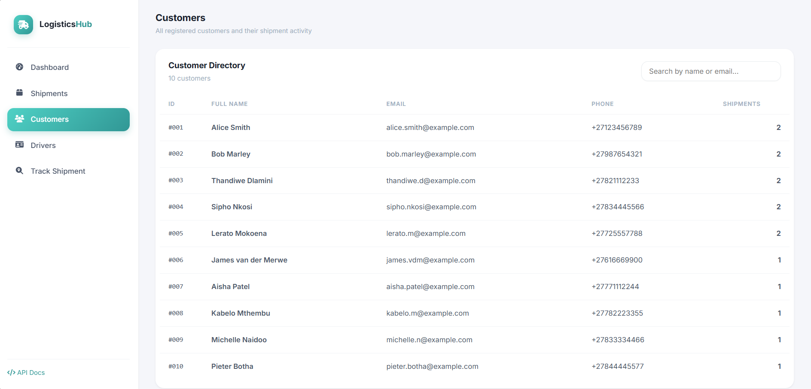

# Logistics Management Platform

**🔗 Live demo: [logistics-api-4rr3.onrender.com](https://logistics-api-4rr3.onrender.com)**

A full-stack logistics management platform built with Spring Boot and PostgreSQL. It handles customer, driver, and shipment management with status workflows, audit trails, driver assignment, dynamic shipping-fee calculation, and a modern admin dashboard.

---

## Screenshots

### Admin Dashboard



### Shipment Details with Status Timeline



### Customer Directory



---

## Features

### Backend

- **Customer management** — full CRUD with search
- **Driver management** — availability tracking
- **Shipment management** — with enriched responses (customer name, driver name, vehicle type)
- **Status workflow** with validated transitions (Pending → Confirmed → In Transit → Out for Delivery → Delivered, plus Cancelled)
- **Status history & audit trail** — every status change is recorded with timestamp and remarks
- **Driver assignment** — reassign any shipment to a different driver
- **Dynamic shipping-fee calculation** — `Base Fee + (Weight × Rate per kg)`
- **Request/response DTOs** — clean API contracts
- **Input validation** — Jakarta Validation on all request bodies
- **RFC 7807 error responses** — proper 400/404/409/500 with typed payloads
- **OpenAPI / Swagger** — full API documentation
- **Automated tests** — controller and service-layer coverage

### Frontend (Admin Dashboard)

- **KPI dashboard** — total, delivered, in transit, pending, cancelled
- **Shipment volume chart** — 7-day activity
- **Delivery rate ring** — animated progress visualisation
- **Search & filter** — by recipient, customer, driver, or status
- **Shipment details page** — full timeline, customer/driver info
- **Customer directory** — with per-customer shipment counts
- **Driver fleet view** — with availability and active shipment counts
- **Public tracking page** — enter a shipment ID, see live status
- **Responsive layout** — works on desktop and mobile

---

## Screenshots Location

Screenshots are stored in `docs/screenshots/`. See [docs/screenshots/README.md](docs/screenshots/README.md) for instructions on regenerating them.

---

## Architecture

```text
                       Client (Browser)
                              │
                              ▼
                    REST Controllers
                              │
                              ▼
                         DTO Layer
                              │
                              ▼
                        Service Layer
                              │
                              ▼
                      Repository Layer
                              │
                              ▼
                      PostgreSQL Database
```

### Layers

**Controllers** — REST endpoints:

- `CustomerController`
- `DeliveryController`
- `DriverController`
- `ShipmentController`
- `StatusUpdateController`

**Services** — business logic:

- `ShipmentService` — shipments, status transitions, driver assignment, fee calculation
- `StatusUpdateService` — status history operations

**DTOs** — request/response contracts:

- `ShipmentRequestDTO`, `ShipmentResponseDTO`
- `ShipmentDetailDTO` — includes status history

**Repositories** — Spring Data JPA interfaces:

- `CustomerRepository`, `DeliveryRepository`, `DriverRepository`
- `ShipmentRepository`, `ShipmentStatusHistoryRepository`, `StatusUpdateRepository`

**Exceptions** — centralised handling:

- `GlobalExceptionHandler` — RFC 7807 responses for 400, 404, 409, 500
- `ResourceNotFoundException`

**Business rules** — `ShipmentStatus`:

- Defines valid statuses and allowed transitions
- Rejects invalid changes like Delivered → Pending with HTTP 409

---

## Shipping Fee Calculation

```text
Shipping Fee = Base Fee + (Package Weight × Rate per kg)
```

- Base Fee: R50.00
- Rate: R12.50 / kg

Example — a 4 kg package:

```text
R50.00 + (4 × R12.50) = R100.00
```

Handled in `ShipmentService.calculateFee()`.

---

## Status Workflow

```text
Pending ──► Confirmed ──► In Transit ──► Out for Delivery ──► Delivered
   │            │              │                │
   └────────────┴──────────────┴────────────────┴──► Cancelled
```

Delivered and Cancelled are terminal — no further transitions allowed.

Every transition writes an entry to `shipment_status_history` with the new status, timestamp, and optional remarks.

---

## Technologies

| Technology | Purpose |
|---|---|
| Java 26 | Language |
| Spring Boot 4.1 | Framework |
| Spring Web | REST API |
| Spring Data JPA | Persistence |
| Hibernate 7 | ORM |
| PostgreSQL 16 | Database |
| Maven | Build tool |
| Jakarta Validation | Input validation |
| Lombok | Boilerplate reduction |
| SpringDoc OpenAPI | Swagger UI & API docs |
| JUnit 5, Mockito | Testing |
| Docker & Docker Compose | Containerised local development |
| Render | Cloud hosting (app + managed Postgres) |
| HTML, CSS, JavaScript | Admin dashboard & tracking UI |

---

## Project Structure

```text
src/main/
├── java/com/example/logistics/
│   ├── config/
│   │   ├── DataSeeder.java             — seeds demo data on first run
│   │   └── OpenApiConfig.java
│   ├── controllers/
│   ├── dtos/
│   ├── exceptions/
│   ├── models/
│   ├── repositories/
│   ├── services/
│   └── LogisticsApplication.java
│
└── resources/
    ├── static/                         — admin dashboard UI
    │   ├── index.html
    │   ├── shipments.html
    │   ├── shipment-details.html
    │   ├── customers.html
    │   ├── drivers.html
    │   ├── track.html
    │   └── css/app.css
    │
    ├── application.properties          — production config (env vars)
    └── application-local.properties    — local dev config (gitignored)
```

---

## API Endpoints

### Shipments

| Method | Endpoint | Description |
|---|---|---|
| GET | `/api/shipments` | List all shipments (enriched) |
| GET | `/api/shipments/{id}` | Get one shipment |
| GET | `/api/shipments/{id}/details` | Get shipment with full status history |
| GET | `/api/shipments/search?status=&name=` | Search by status and/or recipient name |
| POST | `/api/shipments` | Create a shipment |
| PATCH | `/api/shipments/{id}/status` | Update status (validated transitions) |
| PATCH | `/api/shipments/{id}/assign-driver` | Reassign to a driver |

### Customers

| Method | Endpoint | Description |
|---|---|---|
| GET | `/api/customers` | List all customers |
| POST | `/api/customers` | Create a customer |

### Drivers

| Method | Endpoint | Description |
|---|---|---|
| GET | `/api/drivers` | List all drivers |
| POST | `/api/drivers` | Create a driver |

### Status Updates

| Method | Endpoint | Description |
|---|---|---|
| GET | `/api/status-updates` | List status updates |
| GET | `/api/status-updates/shipment/{id}` | Updates for a specific shipment |
| POST | `/api/status-updates` | Create a status update |

---

## Example Requests

### Create a Shipment

```http
POST /api/shipments
Content-Type: application/json

{
  "customerId": 1,
  "driverId": 1,
  "packageWeight": 12.50,
  "recipientName": "Bob Marley",
  "deliveryAddress": "123 Main St, Kimberley",
  "currentStatus": "Pending"
}
```

### Update Status

```http
PATCH /api/shipments/3/status?status=Confirmed&remarks=Verified+by+dispatcher
```

### Invalid Transition (returns 409 Conflict)

```http
PATCH /api/shipments/1/status?status=Pending
```

Response:

```json
{
  "type": "https://api.logistics.com/errors/conflict",
  "title": "Business Rule Violation",
  "status": 409,
  "detail": "Invalid transition from Delivered to Pending",
  "timestamp": "2026-10-04T00:21:43Z"
}
```

---

## Running Locally

### Prerequisites

- Java 26 — Adoptium Temurin recommended
- PostgreSQL 16+ — [download](https://www.postgresql.org/download/)
- Git

Maven is included via the Maven Wrapper (`mvnw` / `mvnw.cmd`).

### Steps

#### 1. Clone the repository

```bash
git clone https://github.com/chacha-debug/logistics-management-api.git
cd logistics-management-api
```

#### 2. Create the database

```sql
CREATE DATABASE logistics_dev;
```

#### 3. Configure local credentials

Create `src/main/resources/application-local.properties`:

```properties
DB_URL=jdbc:postgresql://localhost:5432/logistics_dev
DB_USERNAME=postgres
DB_PASSWORD=your_password_here
```

This file is gitignored — your password won't be committed.

#### 4. Run the application

```bash
# Windows
mvnw.cmd spring-boot:run "-Dspring-boot.run.profiles=local"

# macOS / Linux
./mvnw spring-boot:run -Dspring-boot.run.profiles=local
```

The app starts at `http://localhost:8080`. On first run, `DataSeeder` creates:

- 10 customers
- 5 drivers
- 15 shipments spread over 3 weeks
- 36 status-history entries

#### 5. Open the dashboard

| Page | URL |
|---|---|
| Dashboard | http://localhost:8080/ |
| All Shipments | http://localhost:8080/shipments.html |
| Customers | http://localhost:8080/customers.html |
| Drivers | http://localhost:8080/drivers.html |
| Track Shipment | http://localhost:8080/track.html |
| API Docs | http://localhost:8080/swagger-ui.html |

---

## Running with Docker (optional)

A `Dockerfile` and `docker-compose.yml` are included for containerised development.

```bash
docker compose up --build
```

This starts a PostgreSQL container and the Spring Boot app, and the `DataSeeder` populates demo data automatically.

---

## Testing

```bash
# Windows
mvnw.cmd test

# macOS / Linux
./mvnw test
```

Tests cover:

- Controller validation and HTTP responses (`ShipmentControllerTest`)
- Service-layer status update logic (`StatusUpdateServiceTest`)

---

## Deployment

The application is deployed on Render with:

- Web Service running the Docker image
- Managed PostgreSQL 16 database
- Environment variables for `DB_URL`, `DB_USERNAME`, `DB_PASSWORD`

Pushing to `main` triggers an automatic redeploy.

> **Note:** The Render free tier spins down after 15 minutes of inactivity. The first request after a period of idleness may take 30–60 seconds.

---

## Future Improvements

- JWT authentication and role-based access control (Admin, Dispatcher, Driver, Customer)
- Pagination on list endpoints
- Advanced filtering (date range, driver, customer)
- Email/SMS notifications for status changes
- CI/CD pipeline with GitHub Actions
- Integration tests using Testcontainers
- Custom domain

---

## Author

**Chantele Mucuio**
ICT Student | Aspiring Software Engineer

- GitHub: [@chacha-debug](https://github.com/chacha-debug)
- LinkedIn: [chantele-mucuio-409918382](https://www.linkedin.com/in/chantele-mucuio-409918382/)
- Email: [chantelemucuio@gmail.com](mailto:chantelemucuio@gmail.com)

---

## License

MIT — free to use, learn from, and adapt.